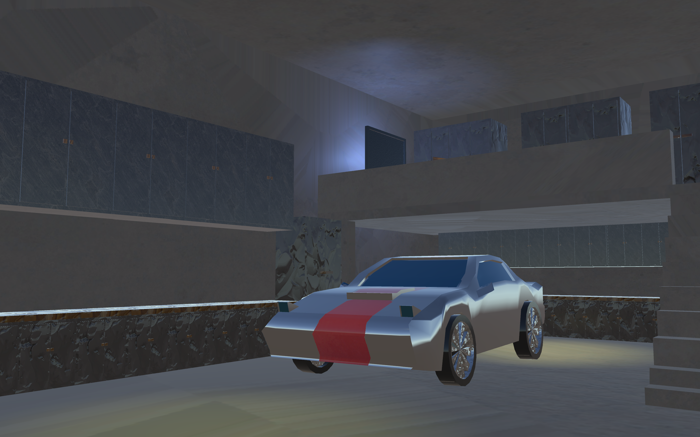
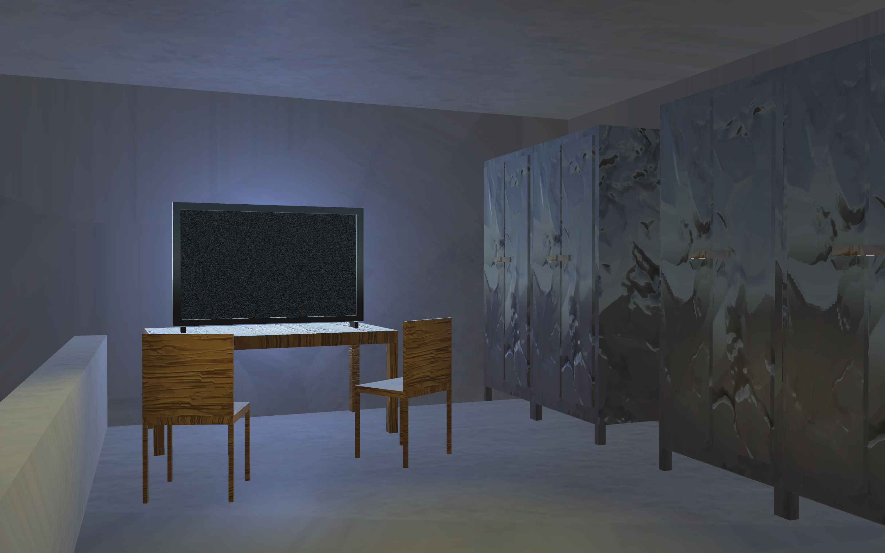
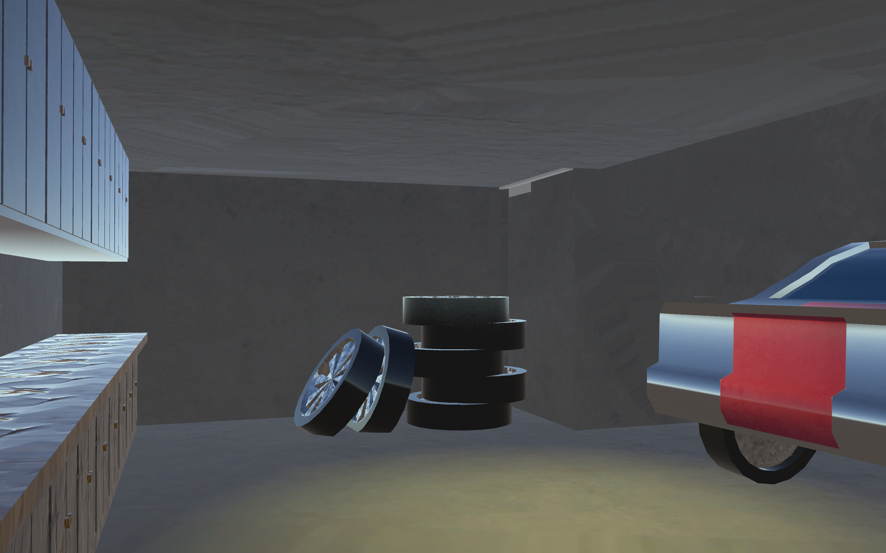

# 3D Garage Environment

**A hand-crafted 3D garage environment you can explore in first person.**

A fully realized 3D garage with furniture, tires, and a vehicle. All modeled, textured, and animated from scratch, then built into Unity as an explorable, first-person walkthrough.

*A solo project exploring the complete 3D art pipeline, from modeling to engine integration.*

---

  

  

  

---

## Overview

This is a solo 3D environment art project: a detailed garage scene built entirely from custom assets. Every object was modeled in Maya, textured in Adobe Substance Painter, and integrated into Unity to create a first-person space the player can walk through and explore, with animated elements bringing the scene to life.

## Features

- **Fully custom environment** — Every asset in the garage, from furniture to tools to vehicles, was modeled from scratch.
- **Production-quality texturing** — Detailed, realistic materials authored per-object in Substance Painter.
- **First-person exploration** — Walk through and take in the space from a player's perspective in Unity.
- **Animated elements** — A tire rolls down the stairs to bring the environment to life.

## Controls

| Action | Control |
| --- | --- |
| Move | `WASD` |
| Look | `Mouse` |

## Development Highlights

- Independently designed and built a fully realized **3D garage environment**, modeling all assets from scratch in Maya.
- Created detailed, **production-quality textures** for every object in Adobe Substance Painter to achieve a realistic style.
- Integrated custom 3D models into the **Unity** engine to build an explorable, first-person walkthrough experience.
- Authored **animation** to add movement and life to the scene.
- Managed the **complete art pipeline solo**, from initial modeling and texturing through engine integration.

## Built With

- **Modeling & Animation:** Autodesk Maya
- **Texturing:** Adobe Substance Painter
- **Engine:** Unity

## Download & Run

1. Download the latest release `.zip`.
2. Extract the **entire** folder.
3. Run the executable to launch the walkthrough.

## About This Project

A self-directed solo project made to practice the full 3D art pipeline end to end by modeling, texturing, animation, and real-time integration. Which resulted in an explorable environment built in Unity.
